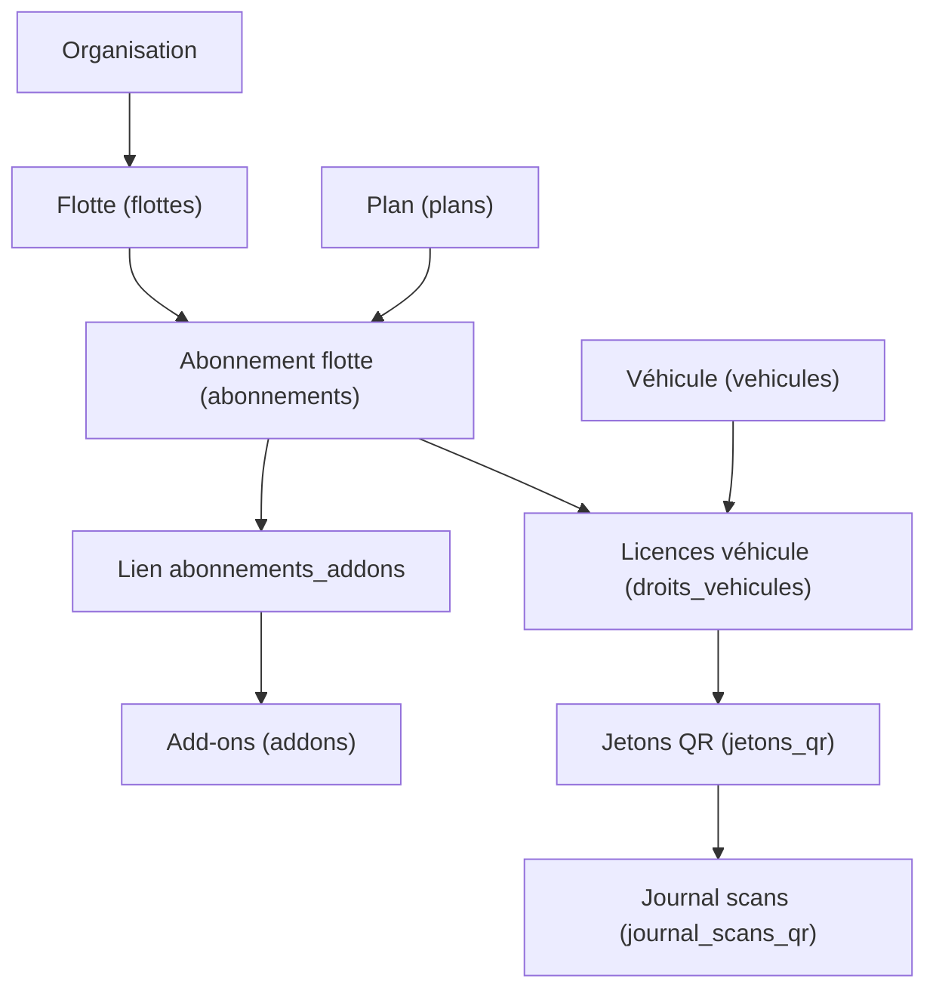

# 💰 Tarifs, Abonnements & QR – E-Samba

## 🎯 Objectif fonctionnel

Ce document décrit comment le modèle économique d’E-Samba (plans, abonnements, licences véhicule et QR d’activation) est implémenté dans la base Supabase, et comment chaque rôle (Organisateur, Gestionnaire, Chauffeur, Mécanicien) interagit avec ces données.

- **Monétisation** : abonnement par véhicule (Flotte ↔ Plan ↔ Licences véhicule).
- **Activation** : paiement → création/renouvellement d’abonnements → licences par véhicule → QR sécurisés.
- **Contrôle** : journalisation des scans, blocages disciplinaires indépendants des paiements.

---

## 1. Modèle de données (vue simplifiée)

### 1.1. Entités principales

- **Plans (`plans`)**
  - Grille tarifaire : `Starter`, `Pro`, `Organisateur`.
  - Champs clés : `code`, `name`, `price_per_vehicle`, `min_commitment_days`, `is_active`.

- **Abonnements de flotte (`abonnements`)**
  - Contrat entre **une flotte** et **un plan**, sur une période donnée.
  - Champs clés : `fleet_id`, `plan_id`, `starts_at`, `ends_at`, `status`.

- **Licences véhicules (`droits_vehicules`)**
  - Une **licence par véhicule et abonnement**.
  - Champs clés :
    - `vehicle_id`, `subscription_id`, `active`
    - `starts_at`, `ends_at`
    - `status` (`active` / `expired` / `revoked`)
    - `is_premium` (licence Premium oui/non).

- **Add-ons (`addons`, `abonnements_addons`)**
  - Add-ons optionnels par abonnement (ex. `pulse_plus`, `qr_premium`).
  - `addons` : catalogue (code, nom, prix par véhicule).
  - `abonnements_addons` : lien abonnement ↔ add-on, avec `quantity` (souvent nombre de véhicules couverts).

- **QR d’activation (`jetons_qr`)**
  - Jeton sécurisé qui autorise des actions sur des licences véhicule.
  - Champs clés :
    - `type` : `vehicle` (un véhicule) ou `lot` (plusieurs véhicules).
    - `vehicle_id` (pour `vehicle`), `fleet_id` (pour `lot`).
    - `subscription_id`, `license_ids` (licences couvertes).
    - `action` : `activate` / `renew` / `reactivate`.
    - `expires_at`, `max_uses`, `used_count`.

- **Journal des scans (`journal_scans_qr`)**
  - Trace chaque scan de QR (qui, quand, résultat, contexte).

- **Blocages disciplinaires (`blocages_discipline`)**
  - Blocage non financier, lié à la discipline ou à la sécurité.
  - Important : un QR **ne lève pas** automatiquement un blocage disciplinaire.

### 1.2. Vue d’ensemble (Mermaid)

---

## 2. Rôles et écrans

### 2.1. Organisateur (multi-flottes)

**Écrans principaux :**

- **Tableau global "Abonnements & Licences" (Organisateur)**
  - Vue par flotte :
    - Nombre de véhicules couverts.
    - Plan courant (`Starter` / `Pro` / `Organisateur`).
    - Statut abonnement (`active`, bientôt expiré, expiré).
    - % de licences Premium.
  - Repose sur : `flottes`, `abonnements`, `droits_vehicules`, `addons`, `abonnements_addons`.

- **Génération QR lot (Organisateur)**
  - Écran "Générer QR Lot" pour activer/prolonger un **lot de véhicules** :
    - Sélection flotte, période, liste de véhicules, option QR Premium.
    - Appelle la RPC `generer_qr(type='lot', fleet_id, vehicle_ids[], subscription_id, ...)`.
  - Repose sur : `vehicules`, `abonnements`, `droits_vehicules`, `jetons_qr`.

- **Journal des scans (Organisateur)**
  - Suivi global des scans (qui scanne, quels QR, quel résultat).
  - Repose sur : `journal_scans_qr`, `jetons_qr`, `droits_vehicules`, `vehicules`.

**Droits back-end :**

- Lecture complète sur les flottes de son organisation.
- Lecture (et génération via RPC) des QR lot.
- Lecture du journal de scans pour ses flottes.

### 2.2. Gestionnaire (flotte unique)

**Écrans principaux :**

- **Abonnement de la flotte**
  - Statut global d’abonnement :
    - Actif / expire dans X jours / suspendu.
    - Nombre de véhicules couverts / Premium.
  - Repose sur : `abonnements`, `droits_vehicules`, `addons`, `abonnements_addons`.

- **Paiement & Activation**
  - Effectue ou enregistre un paiement (intégration future avec `paiements`).
  - Après paiement valide :
    - Provisionne / renouvelle des licences (`droits_vehicules`).
    - Génère des QR via `generer_qr(...)`.

- **QR générés**
  - Onglets :
    - Par véhicule : un QR par véhicule (réactivation / prolongation).
    - Lot : QR couvrant plusieurs véhicules.
  - Repose sur : `jetons_qr`, `droits_vehicules`, `vehicules`.

- **Scanner QR (Gestionnaire)**
  - Workflow :
    1. Scan → appel `analyser_qr(payload)` (APERÇU).
    2. Si `can_apply = true` → bouton "Activer" → `appliquer_qr(qr_token_id)`.
  - Repose sur : RPC `analyser_qr`, `appliquer_qr`, tables QR/licences/journal/blocages.

### 2.3. Chauffeur

- Ne voit pas les écrans de paiement.
- Voit dans la fiche véhicule :
  - Statut abonnement (actif / suspendu abonnement).
  - Éventuel badge **PREMIUM** si `is_premium = true` sur sa licence.
- Ne peut pas scanner ni générer de QR.

### 2.4. Mécanicien

- Voit la priorité maintenance et les badges **PREMIUM** dans son interface atelier.
- Peut consulter l’historique maintenance et incidents associés à des véhicules Premium.
- Ne gère ni paiements, ni QR, ni licences directement.

---

## 3. Mapping Écrans → Tables / RPC

| Écran / Action                                           | Rôle(s)                   | Tables / RPC principales                                                                 |
|----------------------------------------------------------|---------------------------|------------------------------------------------------------------------------------------|
| Page publique "Tarifs"                                   | Anon                      | `plans` (lecture catalogue)                                                              |
| Tableau global "Abonnements & Licences" (Organisateur)  | Organisateur              | `flottes`, `abonnements`, `droits_vehicules`, `addons`, `abonnements_addons`            |
| Détail "Abonnement de la flotte"                        | Gestionnaire, Organisateur| `abonnements`, `droits_vehicules`, `addons`, `abonnements_addons`                       |
| Génération QR véhicule                                   | Gestionnaire              | `vehicules`, `abonnements`, `droits_vehicules`, RPC `generer_qr(...)`                   |
| Génération QR lot                                        | Gestionnaire, Organisateur| `vehicules`, `abonnements`, `droits_vehicules`, RPC `generer_qr(...)`                   |
| Liste QR générés                                         | Gestionnaire              | `jetons_qr`, `droits_vehicules`, `vehicules`                                            |
| Scan QR (aperçu)                                         | Gestionnaire, Organisateur| RPC `analyser_qr(payload)`, `jetons_qr`, `droits_vehicules`, `blocages_discipline`      |
| Application QR (activation/prolongation)                | Gestionnaire, Organisateur| RPC `appliquer_qr(qr_token_id)`, `droits_vehicules`, `jetons_qr`, `journal_scans_qr`    |
| Journal des scans                                        | Organisateur, Gestionnaire| `journal_scans_qr`, `jetons_qr`, `vehicules`, `flottes`                                  |

---

## 4. API SQL / RPC côté base

Les fonctions suivantes sont définies dans `supabase/rpc-qr-licences.sql` :

- **`generer_qr(p_type, p_fleet_id, p_vehicle_ids, p_subscription_id, p_validite_minutes, p_premium)`**
  - Entrées :
    - `p_type` : `'vehicle'` ou `'lot'`.
    - `p_fleet_id` : requis pour les QR de lot.
    - `p_vehicle_ids` : tableau d’`uuid` (un véhicule pour `vehicle`, plusieurs pour `lot`).
    - `p_subscription_id` : abonnement de référence.
    - `p_validite_minutes` : durée de validité.
    - `p_premium` : indicateur optionnel, à utiliser côté produit/marketing.
  - Contrôles :
    - Vérifie les droits manager/organizer (`has_role`).
    - Vérifie que des licences (`droits_vehicules`) existent pour les véhicules choisis.
  - Effets :
    - Crée une entrée dans `jetons_qr` avec `type`, `license_ids`, `expires_at`, `max_uses`, `used_count=0`.
    - Retourne un JSON avec `qr_token_id`, `qr_payload` (`esamba://qr/<id>?sig=<hash>`), `expires_at`, `licenses`.

- **`analyser_qr(p_payload)`**
  - Entrée : `p_payload` (texte du QR scanné).
  - Contrôles :
    - Parse l’ID du token et la signature.
    - Vérifie existence, expiration, usage max.
    - Vérifie les droits (manager/organizer de la flotte).
    - Vérifie l’existence de blocages disciplinaires actifs via `blocages_discipline`.
  - Retour JSON :
    - `ok`, `error` (ou `null`).
    - `qr_token_id`, `type`, `expires_at`, `max_uses`, `used_count`.
    - `can_apply` (false si blocage disciplinaire), `discipline_hold`.

- **`appliquer_qr(p_qr_token_id)`**
  - Entrée : `p_qr_token_id` (UUID).
  - Contrôles :
    - Vérifie expiration et limite d’usage.
    - Vérifie l’absence de `blocages_discipline` actifs sur les véhicules concernés.
  - Effets :
    - Met à jour les licences (`droits_vehicules.status = 'active'`) pour `license_ids`.
    - Incrémente `used_count` sur `jetons_qr`.
    - Écrit dans `journal_scans_qr` un enregistrement (`result = 'success'` ou `discipline_hold`).
  - Retour JSON :
    - `ok`, `error` (ou `null`).
    - `updated_licenses` : nombre de licences modifiées.

---

## 5. Notes pour les développeurs (frontend)

### 5.1. Hooks React Query suggérés

- `usePlans()` : lit le catalogue `plans` (et éventuellement `addons`) pour la page publique Tarifs.
- `useFleetSubscriptions(fleetId)` : lit les abonnements actifs d’une flotte et leurs licences (`abonnements`, `droits_vehicules`, `abonnements_addons`).
- `useGenerateQr()` : mutation qui appelle la RPC `generer_qr(...)`.
- `useScanQr()` : enchaîne `analyser_qr(payload)` puis, si l’utilisateur confirme, `appliquer_qr(qr_token_id)`.
- `useQrJournal(fleetId)` : lit un résumé de `journal_scans_qr` pour une flotte.

Ces hooks doivent respecter l’architecture du projet :

- Composant UI → Hook React Query (`useXxx`) → Service (`xxx.service.ts`) → Repository SQL → Supabase (RPC / tables).

### 5.2. UX recommandée

- **Après un paiement réussi** :
  - Appeler une RPC de provisioning de licences (future) puis `generer_qr(...)`.
  - Afficher un écran :
    - "Paiement confirmé. Téléchargez votre QR d’activation."
    - Boutons : "Télécharger PDF", "Afficher QR", "Envoyer par email/WhatsApp".

- **Lors d’un scan QR** :
  - Étape 1 : appeler `analyser_qr(payload)` et afficher :
    - Véhicules concernés, type de QR, date de validité.
    - Message clair si blocage disciplinaire (`discipline_hold`).
  - Étape 2 : si `can_apply = true`, permettre l’activation via `appliquer_qr(...)`.

---

## 6. Cohérence avec le modèle E-Samba

Ce système permet :

- **Monétisation simple par véhicule** via `plans` + `abonnements` + `droits_vehicules`.
- **Activation instantanée** sur le terrain via QR (`jetons_qr` + RPC).
- **Traçabilité** des actions d’activation/prolongation (`journal_scans_qr`).
- **Contrôle hiérarchique** : seuls Organisateurs/Gestionnaires peuvent générer/appliquer des QR.
- **Blocages disciplinaires séparés** de la dimension purement financière (`blocages_discipline`).

Pour tester une configuration complète, utiliser :

1. **Créer une organisation type** : ouvrir le fichier `supabase/create-demo-organization-complete.sql`, copier **tout son contenu** dans l’éditeur SQL de Supabase, puis exécuter.
2. **Vérifier la cohérence** : ouvrir le fichier `supabase/verify-demo-organization.sql`, copier **tout son contenu** dans l’éditeur SQL de Supabase, puis exécuter.

> Ne pas coller les noms de fichiers seuls dans l’éditeur SQL (erreur de syntaxe). Exécuter le contenu de chaque fichier.

