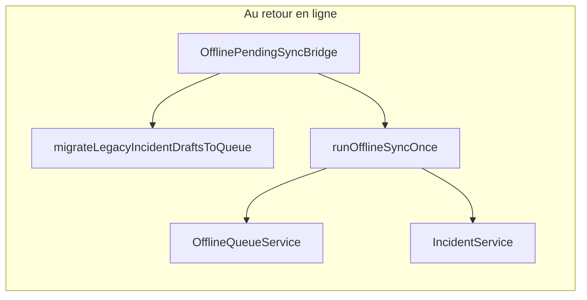

# Cartographie : snippets génériques vs code existant

Ce document aligne des **patterns d’exemple** (souvent basés sur REST, `syncQueue`, `fetch('/api/...')`) sur l’implémentation réelle du dépôt **Smart Fleet Africa / Flotte E-Samba** (Supabase, `OfflineQueueService`, cache local ESAMBA).

---

## Point d’entrée « App » et écoute réseau

| Snippet typique | Dans le projet |
|-----------------|----------------|
| `syncQueue.setupNetworkListener()` + `processQueue()` au montage | **Équivalent présent** : la façade [`syncQueue`](../src/services/syncQueue.service.ts) est bien utilisée par [`OfflinePendingSyncBridge`](../src/components/OfflinePendingSyncBridge.tsx) (monté dans [`AuthProviderLayout`](../src/components/auth/AuthProviderLayout.tsx)). Cette façade délègue la logique à [`migrateLegacyIncidentDraftsToQueue()`](../src/services/offlineSyncOrchestrator.service.ts) + [`runOfflineSyncOnce()`](../src/services/offlineSyncOrchestrator.service.ts). L’état online/offline reste centralisé via [`useNetworkOnline`](../src/features/account/hooks/useNetworkOnline.ts). |

---

## File d’attente et métriques

| Snippet typique | Dans le projet |
|-----------------|----------------|
| `syncQueue.getPendingCount()` / `getQueue()` / `getMetrics()` | [`OfflineQueueService`](../src/services/offlineQueue.service.ts) : `getPendingJobs()`, `getQueueStats()` (pas une API générique `operation/resource`). Persistance : [`offline-queue.storage.ts`](../src/lib/storage/offline-queue.storage.ts), types [`offline-queue`](../src/types/offline-queue.ts). |
| Métriques agrégées de sync | [`getLocalSyncMetrics` / `patchLocalSyncMetrics`](../src/lib/storage/flotteEsambaLocalCache.ts) mises à jour dans [`runOfflineSyncOnce`](../src/services/offlineSyncOrchestrator.service.ts) (runs, durée, jobs traités). |
| `window.__ESAMBA__` | Non utilisé côté runtime applicatif (aucune référence dans `src/`). Le debug passe par DevTools et les couches de stockage local ; la mention peut exister en documentation externe. |

---

## UI : badge et statut de sync

| Snippet typique | Dans le projet |
|-----------------|----------------|
| `<OfflineBadge />` dans un header | Existe : [`OfflineBadge`](../src/components/dashboard/OfflineBadge.tsx), utilisé dans [`DashboardHeader`](../src/components/dashboard/DashboardHeader.tsx). Le composant générique [`MobileHeader`](../src/components/mobile/ui/MobileHeader.tsx) n’intègre pas le badge par défaut : passer `rightAction={<OfflineBadge />}` pour reproduire l’exemple. |
| `<SyncStatus />` + `useSyncQueue` | Équivalents : [`SyncStatusCompact`](../src/components/dashboard/SyncStatusCompact.tsx) + [`useOfflineSyncStatus`](../src/hooks/useOfflineSyncStatus.ts) ; sur l’écran compte, [`SyncStatusIndicator`](../src/features/account/components/SyncStatusIndicator.tsx). Pas de hook `useSyncQueue` sous ce nom. |

---

## Formulaire incident et soumission

| Snippet typique | Dans le projet |
|-----------------|----------------|
| `fetch('/api/incidents')` | **Non applicable** : les incidents passent par [`IncidentService`](../src/services/incident.service.ts) → repositories Supabase, pas une route REST locale. |
| Soumission online vs offline / `queueSubmit` | Implémenté dans [`useDeclareIncident`](../src/hooks/useIncidents.ts) : hors ligne → `saveIncidentDeclarationDraft` + `offlineQueueService.enqueueIncidentCreate` ; en ligne → `declareIncidentWithOptionalEvidence`. Ce n’est **pas** le pattern « toujours mettre en file » : en ligne, l’envoi est **direct**. |
| Page déclaration | [`DeclareIncidentPage`](../src/features/incidents/screens/DeclareIncidentPage.tsx) + [`IncidentDeclarationForm`](../src/features/incidents/components/IncidentDeclarationForm.tsx) (soumission via le hook, pas `fetch`). |

---

## Brouillons legacy et double chemin

- [`syncPendingIncidentDrafts`](../src/services/offlineIncidentSync.service.ts) : synchronise les **brouillons** stockés dans le cache local (états `pending` / `failed`).
- L’orchestrateur traite les **jobs** `incident:create` de la file. Les deux mécanismes coexistent ; le bridge déclenche migration + `runOfflineSyncOnce`.

---

## Cache véhicules

| Snippet typique | Dans le projet |
|-----------------|----------------|
| `localStorage` + clé dédiée + `fetch('/api/vehicles')` | Le cache métier est dans [`flotteEsambaLocalCache`](../src/lib/storage/flotteEsambaLocalCache.ts) (sessions, véhicules récents, brouillons incidents, etc.), alimenté par le flux ESAMBA / app, pas un exemple minimaliste REST. |

---

## Erreurs sync et boundary

| Snippet typique | Dans le projet |
|-----------------|----------------|
| `SyncErrorBoundary` qui écoute `window` « Max retries » | Pas d’équivalent sous ce nom ; les échecs passent par l’état dans le cache (`lastSyncError`), les toasts dans [`OfflinePendingSyncBridge`](../src/components/OfflinePendingSyncBridge.tsx), et le marquage `failed` dans la file. |

---

## Performance (images, Vite, Recharts)

| Snippet typique | Dans le projet |
|-----------------|----------------|
| `vite-plugin-imagemin` | Absent de [`vite.config.ts`](../vite.config.ts) (plugins : React SWC, prerender SEO, PWA). |
| Lazy load Recharts | Déjà adressé par **code-splitting** : `manualChunks` envoie `recharts` vers `vendor-charts` dans [`vite.config.ts`](../vite.config.ts). Un `import()` dynamique supplémentaire n’est utile que pour différer encore le chargement d’un sous-arbre. |
| AVIF / `srcset` | Des assets hero optimisés peuvent apparaître côté build mobile ; la stratégie globale « imagemin à la build » n’est pas dans la config Vite actuelle. |

---

## Synthèse

- Les snippets correspondent **conceptuellement** à ce qui est en place (file hors ligne, badge, sync au retour réseau, hooks d’état), mais les **noms et l’API** diffèrent (`OfflineQueueService`, `useOfflineSyncStatus`, etc.). À noter : une façade `syncQueue` existe bien, mais elle n’est pas le service métier principal de file.
- L’architecture impose **services + repositories** plutôt que `fetch` vers `/api/...`.
- Pour la documentation interne, utiliser les chemins ci-dessus afin d’éviter une deuxième API parallèle ou des exemples non alignés sur le dépôt.

---

## Glossaire minimal (noms proches, rôles différents)

- **Façade `syncQueue`** : couche légère de compatibilité qui expose `runPendingOfflineSync()` et `setupNetworkListener()` ([`syncQueue.service.ts`](../src/services/syncQueue.service.ts)).
- **Orchestrateur offline** : séquence métier de synchronisation (`migrateLegacyIncidentDraftsToQueue`, `runOfflineSyncOnce`, traitement des jobs) ([`offlineSyncOrchestrator.service.ts`](../src/services/offlineSyncOrchestrator.service.ts)).
- **Service de file** : gestion de la queue persistée (enqueue, retry, stats, statuts) ([`offlineQueue.service.ts`](../src/services/offlineQueue.service.ts)).
- **Statut UI** : projection de l’état de sync/réseau pour l’interface (`useOfflineSyncStatus`, `OfflineBadge`, `SyncStatusCompact`) ([`useOfflineSyncStatus.ts`](../src/hooks/useOfflineSyncStatus.ts)).

## Sources de vérité (cartographie offline)

- [src/components/OfflinePendingSyncBridge.tsx](../src/components/OfflinePendingSyncBridge.tsx)
- [src/services/syncQueue.service.ts](../src/services/syncQueue.service.ts)
- [src/services/offlineSyncOrchestrator.service.ts](../src/services/offlineSyncOrchestrator.service.ts)
- [src/services/offlineQueue.service.ts](../src/services/offlineQueue.service.ts)
- [src/hooks/useIncidents.ts](../src/hooks/useIncidents.ts)
- [src/hooks/useOfflineSyncStatus.ts](../src/hooks/useOfflineSyncStatus.ts)

### Documents connexes

- [qa-pwa-offline.md](qa-pwa-offline.md) — checklist QA PWA hors ligne
- [qa-checklist-offline-sync.md](qa-checklist-offline-sync.md) — checklist sync offline
