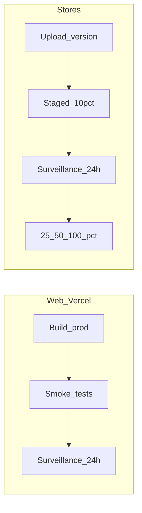

# Rollout production combiné (web + mobile)

Runbook pour aligner le déploiement **Vercel** (web), **Google Play** (Android) et **App Store Connect** (iOS) avec une fenêtre de surveillance et une montée en charge progressive côté stores.

**Références** : [`deployment-e-samba-vercel.md`](./deployment-e-samba-vercel.md), [`publication-stores.md`](./publication-stores.md), [`vercel.json`](../vercel.json), workflow [`.github/workflows/release-android.yml`](../.github/workflows/release-android.yml).

**Avant la prod** : pistes test interne / fermé — [`rollout-beta-stores.md`](./rollout-beta-stores.md).

## Point important : le « pourcentage » diffère par canal

| Canal | Réalité |
|-------|---------|
| **Google Play** | Déploiement par étapes natif (ex. 10 % puis augmentation). |
| **App Store** | **Phased release** (7 jours) ou publication / disponibilité selon votre process. |
| **Vercel (web)** | Pas de split de trafic « 10 % nouvelle version » dans ce dépôt. Équivalents : preview + validation, promotion en production, rollback si incident. |

**Synthèse** : les paliers **10 % → 25 % → 50 % → 100 %** s’appliquent surtout aux **stores** ; le **web** suit un déploiement prod unique après contrôles et une fenêtre de surveillance.

---

## Phase 0 — Pré-requis (gates dépôt + configuration)

### Automatisable en local / CI

- [ ] `npm run lint` — succès.
- [ ] `npm run test` — succès.

### Dashboards (manuel)

**Vercel — variables d’environnement Production** (voir [§2 de deployment-e-samba-vercel](deployment-e-samba-vercel.md)) :

- [ ] `VITE_SUPABASE_URL`, `VITE_SUPABASE_ANON_KEY`
- [ ] `VITE_APP_URL` (ex. `https://www.e-samba.com`) si SEO / canoniques
- [ ] `VITE_SENTRY_DSN` recommandé pour la surveillance post-release
- [ ] Autres clés requises par votre build (Firebase `VITE_FIREBASE_*`, etc.) selon [`.env.example`](../.env.example)

**Supabase** — Authentication → URL Configuration :

- [ ] **Site URL** = URL de prod
- [ ] **Redirect URLs** incluent la prod (et previews si besoin)

---

## Phase 1 — Web (Vercel)

1. [ ] Merger / pousser la branche cible (souvent `main`) pour déclencher le build **Production** Vercel.
2. [ ] Option : valider sur une **Preview** (URL de branche) avant ou après merge, selon la politique équipe.
3. [ ] **Smoke tests** — checklist §5 de [`deployment-e-samba-vercel.md`](deployment-e-samba-vercel.md) (chargement, auth, pas d’erreur `VITE_*`, diagnostic si besoin).

**Équivalent « 10 % web »** : validation interne (équipe / bêta) sur preview ou procédure avant diffusion complète — pas un pourcentage automatique Vercel.

---

## Phase 2 — Mobile (stores)

### Android (Google Play)

1. [ ] Aligner versions : `npm run mobile:sync-version` (voir [`publication-stores.md`](publication-stores.md)).
2. [ ] Produire l’AAB : tag `v*` ou `workflow_dispatch` sur `Release Android (AAB)`, ou build local (`bundleRelease`).
3. [ ] Play Console — nouvelle version **Production** avec **déploiement par étapes** à **10 %**.

### iOS (App Store Connect)

1. [ ] `npm run mobile:prepare`, archive dans Xcode, upload vers App Store Connect.
2. [ ] Activer **Phased release** ou suivre votre politique de publication (les paliers ne sont pas identiques à Play ; adapter « 25 % / 50 % » aux options réelles).

---

## Phase 3 — Surveillance 24 h (tous canaux)

Cocher après la fenêtre de garde :

- [ ] **Sentry** : nouveaux issues, pics anormaux (release / environnement).
- [ ] **Vercel** : logs de déploiement, erreurs si disponibles sur le plan.
- [ ] **Supabase** : logs Auth / API / erreurs si activés.
- [ ] **Play Console** : ANR, crashes, taux d’erreurs par version.
- [ ] **App Store Connect** : métriques équivalentes si disponibles.

**Critères de blocage** avant d’augmenter le rollout : pas de régression majeure (crash rate, 5xx, auth), pas d’incident sécurité ou données.

---

## Phase 4 — Extension : 25 % → 50 % → 100 %

- [ ] **Play** : augmenter le pourcentage du déploiement par étapes ; espacer les paliers (ex. 24 h) selon la politique équipe.
- [ ] **App Store** : poursuivre le phased release ou les étapes manuelles dans la console.
- [ ] **Web** : pas d’étape « 25 % » ; si la prod est stable après la fenêtre, la release web est **validée**. En cas de bug : **Instant Rollback** ou redeploy du commit précédent sur Vercel.

---

## Rappels rapides

- Les identifiants et secrets ne se commitent pas ; keystore Android : voir [§ Fichiers sensibles](publication-stores.md#fichiers-sensibles-ne-pas-commiter) dans `publication-stores.md`.
- Observabilité front : `VITE_SENTRY_DSN`, initialisation dans [`src/instrument.ts`](../src/instrument.ts).
