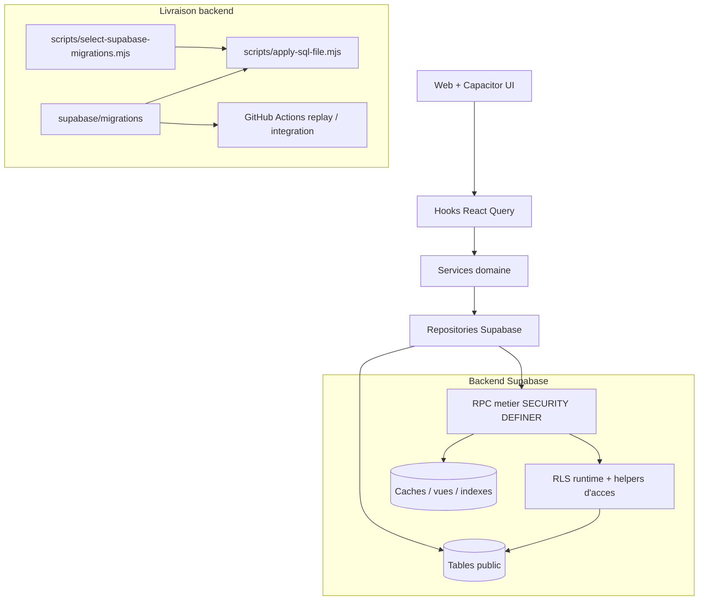

# Backend architecture cible - branche manual-supabase-migrations

Ce document decrit la nouvelle architecture backend issue de la branche
`manual-supabase-migrations`, analysee depuis le premier commit `dasbap` propre a
la branche par rapport a `origin/main` :

- premier commit de branche : `ed780b8` - `correction interface invitation`
- dernier commit analyse : `1addded` - `ci: align integration metrics with targeted Supabase tests`
- PR concernee : `Manual supabase migrations` / PR #22

Il complete `CURRENT_ARCHITECTURE.md` et `TARGET_ARCHITECTURE.md` avec la forme
backend concrete introduite par cette branche.

## Decision centrale

Le backend runtime devient un backend Supabase structure autour de trois
frontieres explicites :

1. **Contrats RPC Postgres** pour les operations metier sensibles.
2. **RLS + helpers SECURITY DEFINER** pour l'isolation multi-tenant et les
   chemins chauds.
3. **CI de replay/apply migrations** pour garantir que le schema est rejouable,
   deployable et coherent sur base fraiche comme sur cible distante.

Le client React/Capacitor continue d'utiliser les couches existantes :

```text
UI -> Hooks React Query -> Services -> Repositories -> Supabase RPC / tables RLS
```

Mais les mutations critiques ne doivent plus dependre d'INSERT/UPDATE directs
fragiles sous RLS. Elles passent par des RPC explicites qui valident `auth.uid()`,
le role flotte, l'idempotence, et les regles metier.

## Vue d'ensemble



## Modules backend

### 1. Acces flotte et RLS runtime

Responsabilite : centraliser les decisions d'acces multi-tenant dans des helpers
Postgres stables et reutilisables.

Nouveaux helpers principaux :

- `fleet_has_active_role(p_fleet_id, p_roles)`
- `fleet_can_read(p_fleet_id)`
- `fleet_can_manage(p_fleet_id)`
- `fleet_can_operate(p_fleet_id)`
- `assignment_can_read(...)`
- `assignment_can_drive_by_id(...)`
- `vehicle_can_read(...)`
- `incident_can_read(...)`
- `incident_can_insert(...)`

Tables/politiques restructurees :

- `vehicules`
- `affectations_vehicules`
- `creneaux_conducteurs`
- `incidents`
- `clotures_creneaux`
- `profils`

Objectif : eviter l'empilement de politiques RLS imbriquees et reduire les
risques de recursion, tout en conservant l'autorisation au niveau DB.

### 2. Operations terrain conducteur

Responsabilite : fournir des contrats serveur pour les operations mobiles et
offline-first.

RPC / contrats :

- `affecter_vehicule(p_fleet_id, p_vehicle_id, p_driver_user_id, p_starts_at)`
- `fermer_creneau(...)` reste le contrat de fermeture de creneau.
- `calculer_recette_attendue(p_shift_id)`
- `review_shift_closure_for_actor(...)`

Regles metier cote backend :

- utilisateur authentifie obligatoire ;
- blocage vehicule si statut `blocked` ;
- refus affectation si conducteur deja actif ailleurs ;
- prise en compte du scoring conducteur quand disponible ;
- blocage si cloture recente manquante ;
- validation/rejet de cloture reservee aux managers/organizers de la flotte ;
- calcul serveur de `expected_revenue` et `revenue_gap`.

Cote client, `DriverShiftRepository` appelle ces RPC plutot que de manipuler
directement les lignes sensibles quand la mutation porte une regle metier.

### 3. Profils conducteurs

Responsabilite : permettre la lecture/mutation minimale des profils conducteurs
par les managers de flotte sans exposer largement `public.profils`.

Contrats :

- `is_fleet_manager_of_user(p_user_id)`
- `upsert_driver_profile_for_actor(p_driver_user_id, p_full_name, p_phone)`

RLS :

- `profils_select_fleet`
- `profils_insert_fleet_manager`
- `profils_update_fleet_manager`

Cote client, `DriverProfileRepository.updateByDriverId` tente l'update direct,
puis utilise le fallback RPC `upsert_driver_profile_for_actor` lorsque l'insert
direct serait fragile sous RLS.

### 4. Dashboard, validation flotte et activation conducteur

Responsabilite : exposer des lectures agregees stables pour le dashboard et les
ecrans de pilotage.

Contrats :

- `get_fleet_dashboard_metrics(p_fleet_id)`
- `fleet_driver_activation_health(p_fleet_id)`
- vues de validation flotte et indexes associes

Principes :

- les lectures de dashboard restent filtrees par `fleet_id` ;
- les agregats lourds peuvent passer par cache/vues/indexes ;
- les erreurs d'ambiguite `has_role` sont resolues par casts explicites vers
  `public.role_type` ou par helpers dedies.

### 5. Invitations et onboarding

Responsabilite : rendre les invitations robustes avant et apres authentification.

Contrats client/backend :

- `accepter_invitation(p_code)`
- `valider_code_invitation(p_code)`
- repository `InvitationRepository` qui mappe les erreurs RLS/duplicat vers des
  erreurs utilisateur.

Architecture attendue :

- validation de code possible avant session utilisateur quand necessaire ;
- acceptation apres auth ;
- creation/modification reservee aux roles fleet manager/organizer via RLS.

### 6. Delivery migrations et CI

Responsabilite : livrer le backend Supabase comme un produit versionne.

Pieces ajoutees ou durcies :

- `scripts/apply-sql-file.mjs`
- `scripts/select-supabase-migrations.mjs`
- `.github/workflows/supabase-apply-migrations.yml`
- replay local sur stack propre ;
- integration tests Supabase distants ;
- validation baseline + deltas ;
- pin Supabase CLI `2.102.0` pour eviter les echecs `latest` rate-limited ;
- perimetre integration metrics aligne sur les tests Supabase maintenus.

Le backend n'est pas considere livrable si les migrations ne passent pas au
minimum :

- replay sur base fraiche ;
- tests d'integration Supabase cibles ;
- verification objets post-migration.

## Regles d'architecture a appliquer apres cette branche

### Mutations metier

Une mutation doit passer par une RPC quand elle remplit au moins un critere :

- elle depend du role flotte ;
- elle modifie plusieurs tables ou colonnes coherentes ;
- elle doit rester idempotente ;
- elle utilise `auth.uid()` ;
- elle contournerait difficilement RLS avec un INSERT/UPDATE direct ;
- elle calcule une valeur serveur comme `expected_revenue` ou `revenue_gap`.

Exemples : affecter un vehicule, fermer un creneau, valider une cloture,
upsert un profil conducteur, accepter une invitation.

### Lectures simples

Les lectures simples peuvent rester en `supabase.from(...)` si :

- la table a une RLS claire ;
- le filtre `fleet_id` ou `user_id` est explicite ;
- la requete ne depend pas d'une logique metier multi-table complexe.

Exemples : listes filtrees de vehicules, creneaux, clotures, profils deja
autorises par RLS.

### Helpers RLS

Les helpers RLS doivent :

- etre `STABLE` quand possible ;
- fixer `search_path = public` ;
- utiliser `SECURITY DEFINER` seulement pour sortir d'une recursion RLS ;
- couper `row_security = off` seulement dans les helpers d'autorisation audites ;
- retirer l'execution a `anon` sauf besoin documente ;
- accorder uniquement a `authenticated` ou `service_role`.

### Nommage RPC

Le nom des parametres RPC fait partie du contrat PostgREST. Toute fonction appelee
depuis le frontend doit conserver les noms exacts utilises par les repositories.

Exemple de contrat stable :

```text
affecter_vehicule(
  p_fleet_id,
  p_vehicle_id,
  p_driver_user_id,
  p_starts_at
)
```

Renommer un parametre dans un `CREATE OR REPLACE FUNCTION` peut casser le replay
Postgres ou les appels PostgREST.

## Frontieres de securite

| Couche | Role |
| --- | --- |
| Supabase Auth | Identite utilisateur, `auth.uid()` |
| RLS | Isolation ligne par ligne et multi-tenant |
| RPC SECURITY DEFINER | Orchestration metier privilegiee mais bornee |
| `service_role` | CI, tests, scripts admin, jamais bundle client |
| Repositories | Contrats TypeScript et mapping erreurs utilisateur |

Aucun secret backend ne doit etre expose dans une variable `VITE_*`. Les secrets
CI attendus restent :

- `VITE_SUPABASE_URL`
- `VITE_SUPABASE_ANON_KEY`
- `SUPABASE_SERVICE_ROLE_KEY`

## Tests cibles

Tests d'integration maintenus pour la branche :

- `tests/integration/rls.fleet-access.test.ts`
- `tests/integration/triggers.vehicle-limit.test.ts`
- `tests/integration/fuel.fraud-scoring.test.ts`

Ces tests valident :

- creation utilisateur de test via service role ;
- bootstrap membership via client authentifie ;
- RLS flotte active/desactivee ;
- limite vehicules plan free ;
- scoring fraude carburant.

Les anciens tests d'integration globaux doivent etre soit modernises sur les
nouveaux helpers, soit exclus des checks bloquants s'ils dupliquent les tests
cibles.

## Architecture cible finale

```text
Backend principal
  Supabase PostgreSQL
    Tables tenant-aware
    RLS active
    Helpers d'autorisation runtime
    RPC metier SECURITY DEFINER
    Indexes chemins chauds

Backend applicatif optionnel
  BFF Node / Edge Functions
    Paiements
    Webhooks
    Jobs asynchrones
    Integrations externes

Client
  Repositories
    Appels RPC pour mutations sensibles
    Requetes directes pour lectures simples
  Services
    Validation UX et orchestration front
  Hooks React Query
    Cache, invalidation, retries, offline queue

Delivery
  Migrations SQL idempotentes
  Replay base fraiche
  Apply cible distante
  Tests integration Supabase
```

La nouvelle architecture backend de cette branche n'est donc pas un backend REST
centralise : c'est un backend Supabase contractuel, ou les RPC Postgres sont les
endpoints metier et ou la securite multi-tenant reste appliquee au plus pres des
donnees.
