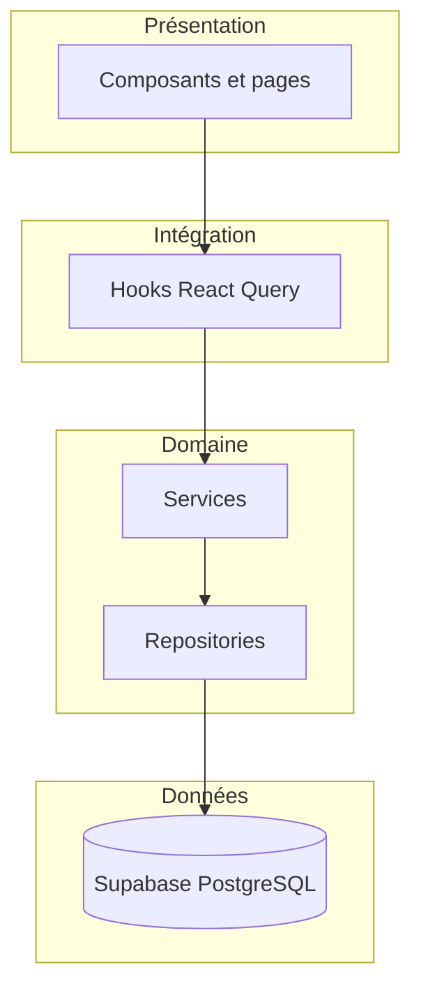

# Architecture actuelle (vérité dépôt)

Ce document est la **référence canonique** pour la stack et les flux techniques du dépôt **smart-fleet-africa** (produit web **E-Samba / Flotte**). Il remplace toute description contradictoire ailleurs (par exemple un contexte générique « Next.js + Prisma » qui ne correspond pas à ce repository).

## Synthèse exécutable

| Couche | Technologie réelle |
| --- | --- |
| Build / dev | **Vite** (`npm run dev`), TypeScript |
| Routage | **React Router v6** (`BrowserRouter`, `Routes`) |
| UI | React, **Tailwind CSS**, **shadcn/ui** (Radix) |
| Données temps réel | **Supabase** (PostgreSQL + Auth + API REST générée + RLS) |
| État serveur client | **TanStack Query** (React Query) |
| Mobile embarqué | **Capacitor** (scripts `build:capacitor`, `mobile:prepare`, etc.) ; dépôt monorepo avec workspace `packages/db` |
| Schéma SQL effectif | Migrations sous `supabase/migrations/` et baseline |

## Flux applicatif (couches)

La règle métier côté client : **composants → hooks → services → repositories → Supabase**. Les repositories encapsulent les appels `supabase.from(...)` / RPC.

Le détail des conventions (exemples, anti-patterns) est maintenu dans [docs/ARCHITECTURE.md](../ARCHITECTURE.md).

Un **BFF Node optionnel** (`src/server/`, `npm run dev:api`) expose des routes `/api/*` pour la facturation et les paiements lorsque `VITE_API_BASE_URL` est configuré ; la vérité schéma et la RLS restent sur Supabase. Voir [PAYMENTS.md](./PAYMENTS.md) et [TARGET_ARCHITECTURE.md](./TARGET_ARCHITECTURE.md).

## Point d’entrée et routage

- Racine React : [src/main.tsx](../../src/main.tsx) (bootstrap i18n, préchargement de chunks, Sentry différé, PWA en prod).
- Application : [src/App.tsx](../../src/App.tsx) — `BrowserRouter`, `Providers`, routes depuis [src/app/routes/app.routes.tsx](../../src/app/routes/app.routes.tsx).

## Authentification (aperçu)

Trois modes possibles : **mock** (`VITE_USE_MOCK_AUTH`), **Clerk** (`VITE_AUTH_PROVIDER=clerk`), **Supabase Auth** (défaut). Détail : [AUTH_FLOW.md](./AUTH_FLOW.md).

## Multi-tenant (aperçu)

Isolation par **organisation** (`org_id`) et **flotte** (`fleet_id`), adhésions et RLS côté Postgres. Détail : [MULTITENANT.md](./MULTITENANT.md).

## Prisma vs Supabase

- **Runtime de l’app web** : accès données via le **client Supabase** ([src/integrations/supabase/client.ts](../../src/integrations/supabase/client.ts)), pas via Prisma Client dans le navigateur.
- **Package** [packages/db/prisma/schema.prisma](../../packages/db/prisma/schema.prisma) : schéma Prisma utilisé pour `prisma generate` (postinstall / build, workspace npm). Il sert de **modèle / tooling** (types, génération) ; la **source de vérité des migrations déployées** en production pour la BDD Supabase reste le dossier **`supabase/migrations/`**.
- Toute divergence Prisma ↔ SQL appliquée doit être résolue en faveur des **migrations Supabase** réellement déployées.

## Variables d’environnement (Vite)

Préfixe **`VITE_`** : exposées au bundle client — ne jamais y mettre de secrets serveur.

| Variable | Rôle |
| --- | --- |
| `VITE_SUPABASE_URL` | URL du projet Supabase |
| `VITE_SUPABASE_ANON_KEY` | Clé anon (publique côté client ; droits limités par RLS) |
| `VITE_USE_MOCK_AUTH` | Auth mock locale (développement / démo) |
| `VITE_AUTH_PROVIDER` | `clerk` pour Clerk ; autre valeur ou absent → Supabase Auth |
| `VITE_CLERK_PUBLISHABLE_KEY` | Clé publique Clerk ; si absente, le provider Clerk n’est pas embarqué (tree-shaking) |
| `VITE_SENTRY_DSN` | Observabilité erreurs (optionnel) |
| `VITE_POSTHOG_KEY` / `VITE_POSTHOG_HOST` | Analytics (optionnel) |
| `VITE_APP_URL` | URL canonique du site (SEO / partage) |
| `VITE_ORANGE_MONEY_MERCHANT` / `VITE_MTN_MOMO_MERCHANT` | Affichage / flux paiement MoMo côté front |
| `VITE_API_BASE_URL` | URL de base du BFF (ex. `/api` avec proxy Vite) ; si absent, facturation / MoMo passent par le client Supabase direct |
| `VITE_DEV_BFF_PROXY` | `true` : proxy Vite vers le BFF local (voir [vite.config.ts](../../vite.config.ts)) |

Les secrets Edge Functions, BFF (`SUPABASE_SERVICE_ROLE_KEY`, `PAYMENTS_WEBHOOK_SECRET`, etc.) et crons ne sont **pas** préfixés `VITE_` ; ils se configurent côté projet Supabase. Voir [docs/SUPABASE-SETUP.md](../SUPABASE-SETUP.md).

## Documentation associée

- Couches Repository / Service / hooks : [docs/ARCHITECTURE.md](../ARCHITECTURE.md)
- Navigation et parcours utilisateur : [docs/flux-navigation.md](../flux-navigation.md)
- Flux d’auth détaillé (post-login) : [docs/auth-flow.md](../auth-flow.md)
- Setup Supabase : [docs/SUPABASE-SETUP.md](../SUPABASE-SETUP.md)
- Cible d’évolution documentée (sans engagement implicite de migration) : [TARGET_ARCHITECTURE.md](./TARGET_ARCHITECTURE.md)

## Note sur `CLAUDE.md` à la racine

Le fichier [CLAUDE.md](../../CLAUDE.md) est **aligné sur ce dépôt** (Vite, React Router, `src/app/`, Supabase, Clerk optionnel) et renvoie ici pour l’architecture détaillée. Toute ancienne mention « Next.js App Router » hors de ce dépôt ne s’applique pas au code de **smart-fleet-africa**.
