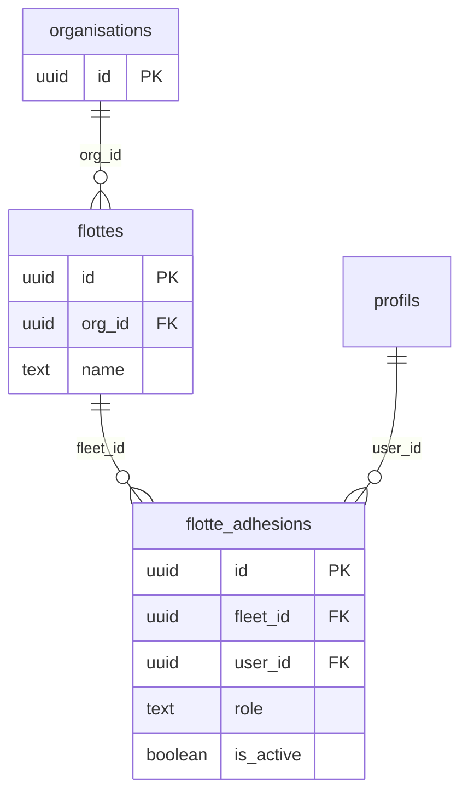

# Multi-tenant (organisations, flottes, RLS)

Ce document décrit le **modèle d’isolation** tel qu’implémenté dans ce dépôt : données sous PostgreSQL (Supabase), contrôle d’accès **RLS**, contexte **fleet** / **org** côté client.

## Modèle de données (conceptuel)

- **`organisations`** : entité « compte » / tenant billing côté `org_id` (ex. paiements liés à `org_id`).
- **`flottes`** : unité opérationnelle quotidienne (véhicules, incidents, etc.) ; chaque flotte appartient à une organisation via `flottes.org_id`.
- **`flotte_adhesions`** : lien utilisateur ↔ flotte avec **rôle** (`role_type`) et **`is_active`**. L’utilisateur authentifié `auth.uid()` ne doit voir que les flottes où il a une adhésion active, sauf politiques spécifiques (admin).

Schéma SQL de référence : migrations sous `supabase/migrations/` (ex. création cœur dans `20240101000000_greenfield_core_schema.sql`).

## Isolation : RLS et `auth.uid()`

- Les politiques **Row Level Security** sur les tables `public.*` filtrent les lignes selon **`auth.uid()`** et les adhésions (sous-requêtes sur `flotte_adhesions`).
- Toute requête via la clé **anon** du client est donc bornée par ces politiques ; le backend ne « fait pas confiance » au `fleet_id` passé en query sans cohérence RLS (les RPC `SECURITY DEFINER` sont des exceptions explicites à auditer au cas par cas).

### Exemple de politique (lecture flotte pour membre actif)

Fichier : [supabase/migrations/20260418220000_flottes_select_active_member_rls.sql](../../supabase/migrations/20260418220000_flottes_select_active_member_rls.sql) — politique `flottes_select_active_member` : un utilisateur **`authenticated`** peut lire une ligne `flottes` s’il existe une adhésion active `flotte_adhesions` pour `(fleet_id, user_id = auth.uid())`. Cela permet notamment de résoudre `org_id` côté client sans élargir indûment les droits d’écriture.

## Couche applicative (client)

- **Adhésions** : chargées après session (voir `SupabaseAuthProvider` dans [src/contexts/AuthProvider.tsx](../../src/contexts/AuthProvider.tsx)), via services / repositories (ex. `FleetMemberService.getActiveMembershipsForUser`).
- **Flotte active** : clé localStorage **`esamba.active_fleet_id`** (`ACTIVE_FLEET_STORAGE_KEY`). Le changement valide que l’utilisateur est bien membre de la flotte cible (`setActiveFleetId`).
- **Contexte tenant** : `activeTenantContext` agrège `orgId`, `fleetId`, rôle, etc., pour les écrans et hooks (`useBilling`, requêtes métier filtrées par `fleet_id`).
- **Nettoyage** : au bootstrap, [src/main.tsx](../../src/main.tsx) appelle `clearInvalidActiveFleetStorage()` pour éviter un UUID de flotte invalide ou incohérent avec les adhésions (réduit les états bloqués).

## Bonnes pratiques

- Toujours passer un **`fleet_id`** explicite aux services lorsque la donnée est partitionnée par flotte.
- Ne pas exposer dans l’UI des détails d’erreur Postgres ; mapper vers des messages utilisateur.
- Lors de nouvelles tables multi-tenant : ajouter `fleet_id` (et/ou `org_id` si pertinent), index, et **politiques RLS** dans la même livraison migration.

## Documentation associée

- Préconisations RLS / adhésions : [docs/preconisations-rls-adhesions-flotte.md](../preconisations-rls-adhesions-flotte.md)
- Flux auth et onboarding : [docs/auth-flow.md](../auth-flow.md), [AUTH_FLOW.md](./AUTH_FLOW.md)
- Changelog multi-tenant SaaS (historique) : [docs/changelog-pr-multi-tenant-saas.md](../changelog-pr-multi-tenant-saas.md)
