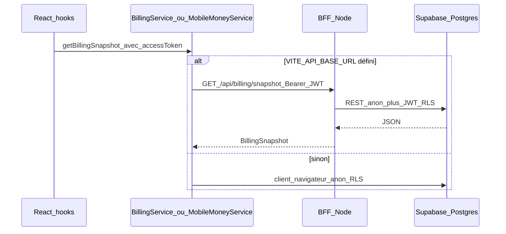

# Paiements et facturation

Ce document décrit le **modèle métier facturation** tel qu’il apparaît dans le schéma Supabase et les chemins de code principaux du dépôt web.

## Schéma de données (tables clés)

Définition de référence (extrait) : [supabase/scripts/setup/schema.sql](../../supabase/scripts/setup/schema.sql) et baseline `supabase/baseline/`.

| Table | Rôle |
| --- | --- |
| **`plans`** | Catalogue (code unique, nom, `price_per_vehicle`, engagement minimum en jours, `is_active`). |
| **`paiements`** | Transaction : `org_id`, `provider`, `amount`, `currency` (défaut **XAF**), `external_ref`, `status`, `idempotency_key` (unicité par couple `provider` + clé), `raw_payload` JSON optionnel. |
| **`abonnements`** | Souscription flotte : `fleet_id`, `plan_id`, `payment_id` optionnel, `starts_at` / `ends_at`, `status`. |
| **`droits_vehicules`** | Licence par véhicule liée à un abonnement (`vehicle_id`, `subscription_id`, fenêtre `starts_at` / `ends_at`, `status`, `is_premium` selon migrations). |

Relations utiles :

- Un **paiement** est rattaché à une **organisation** (`paiements.org_id` → `organisations`).
- Un **abonnement** est rattaché à une **flotte** (`abonnements.fleet_id` → `flottes`) et référence un **plan** ; le lien org ↔ flotte passe par `flottes.org_id` (voir [MULTITENANT.md](./MULTITENANT.md)).

## Chemin applicatif : snapshot de facturation

Pour l’UI et les gardes (ex. upgrade si abonnement payant expiré) :

1. Hook **[src/hooks/useBilling.ts](../../src/hooks/useBilling.ts)** — clé React Query `["billing-snapshot", orgId, fleetId, …]`, activé seulement si `orgId` et `fleetId` sont définis ; transmet le **jeton Supabase** au service lorsque le BFF est activé.
2. **[src/services/billing.service.ts](../../src/services/billing.service.ts)** — `getBillingSnapshot` : si `VITE_API_BASE_URL` est défini **et** qu’une session existe, appel `GET {VITE_API_BASE_URL}/api/billing/snapshot` avec `Authorization: Bearer <access_token>` ; sinon même logique qu’auparavant via repository (requêtes Supabase directes avec la clé anon et la RLS).
3. **[src/repositories/billing.repository.ts](../../src/repositories/billing.repository.ts)** — requêtes Supabase sur `abonnements`, `plans`, `paiements` (chemin « client-only »).
4. **BFF** — [src/server/http/app.ts](../../src/server/http/app.ts) : route `GET /api/billing/snapshot` ; le serveur recrée un client Supabase **anon + JWT utilisateur** ([src/server/infra/supabaseUserClient.ts](../../src/server/infra/supabaseUserClient.ts)), donc **mêmes politiques RLS** que le navigateur.

### Première tranche verticale (facturation + MoMo + webhook minimal)

- **Initiation MoMo** : `POST /api/payments/mobile-money/initiate` (même principe JWT + insert `paiements` sous RLS). Côté front : `MobileMoneyService.initiatePayment` avec option `accessToken` (voir [src/hooks/useMoMoPayment.ts](../../src/hooks/useMoMoPayment.ts)). Le `raw_payload` inclut `planCode`, `fleetId`, `vehicleCount`, `durationMonths`, `phoneNumber` et optionnellement `vehicleIds` (UUID) pour cibler les véhicules lors de l’activation webhook.
- **Webhook entrant** : `POST /api/webhooks/payments/inbound` — corps JSON `{ "external_ref", "status" }` (statut brut normalisé côté serveur, voir ci-dessous). Authentification par **fournisseur** (`x-psp-provider`) :
  - `generic` (défaut) : en-tête `x-payments-webhook-secret` = `PAYMENTS_WEBHOOK_SECRET`.
  - `notch` : `NOTCH_WEBHOOK_SECRET` ; signature HMAC-SHA256 hex du corps brut dans `x-notch-signature` (stub prêt pour Notch Pay).
  - `cinetpay` : `CINETPAY_WEBHOOK_SECRET` ; `x-cinetpay-signature` (stub CinetPay).
- **Effets métier** : si le statut normalisé est **`succeeded`**, le BFF (service role) met à jour `paiements`, puis crée ou prolonge un **`abonnements`** actif (même plan = prolongation de `ends_at` ; autre plan = annulation de l’ancien actif + nouvelle ligne) et upsert les lignes **`droits_vehicules`** pour les véhicules listés dans `vehicleIds` ou les `vehicleCount` premiers véhicules de la flotte. Idempotence : si un abonnement existe déjà avec `payment_id` = ce paiement, aucune duplication.

### Machine d’états `paiements.status`

Référence code : [src/lib/billing/paymentStates.ts](../../src/lib/billing/paymentStates.ts).

| Valeur SQL recommandée | Rôle |
| --- | --- |
| `initiated` / `pending` / `processing` | Paiement non finalisé. |
| `succeeded` | Paiement confirmé ; déclenche l’orchestration abonnement + droits. |
| `failed` / `canceled` / `refunded` | États terminaux négatifs ou clôture. |

Les webhooks peuvent envoyer des synonymes (`paid`, `success`, `declined`, …) : ils sont **normalisés** avant écriture. Les transitions depuis un état **terminal** sont refusées (sauf `succeeded` → `refunded`). Rejeu de webhook : même `external_ref` + même statut cible → idempotent.

### Variables d’environnement (BFF)

| Variable | Rôle |
| --- | --- |
| `SUPABASE_URL` / `SUPABASE_ANON_KEY` | Préférés en prod pour le process Node ; en dev le code accepte aussi `VITE_SUPABASE_*` si chargés dans l’environnement du process (voir [src/server/env.ts](../../src/server/env.ts)). |
| `SUPABASE_SERVICE_ROLE_KEY` | Requis pour le webhook inbound (mise à jour `paiements` + orchestration `abonnements` / `droits_vehicules`). |
| `PAYMENTS_WEBHOOK_SECRET` | Mode `generic` : en-tête `x-payments-webhook-secret`. |
| `NOTCH_WEBHOOK_SECRET` | Mode `x-psp-provider: notch` : signature `x-notch-signature`. |
| `CINETPAY_WEBHOOK_SECRET` | Mode `x-psp-provider: cinetpay` : signature `x-cinetpay-signature`. |
| `BFF_PORT` | Port d’écoute (défaut **8787**). |

### Développement local

- Terminal 1 : `npm run dev` (Vite, port 8080 par défaut).
- Terminal 2 : `npm run dev:api` (BFF ; charger les mêmes URL/clés Supabase que `.env.local`, ex. `node --env-file=.env.local` si vous préfixez les variables côté fichier).
- Activer le proxy : `VITE_DEV_BFF_PROXY=true` dans `.env.local` et `VITE_API_BASE_URL=/api` pour que le navigateur appelle le BFF via le même origine.

### Où c’est affiché ou consommé

- Page **Finances** : [src/pages/Finances.tsx](../../src/pages/Finances.tsx).
- Écran facturation (feature) : [src/features/billing/screens/BillingPage.tsx](../../src/features/billing/screens/BillingPage.tsx).
- Agrégateur de flux auth : [src/hooks/useAuthFlow.ts](../../src/hooks/useAuthFlow.ts) (décision `/upgrade` si `lapsedPaid` — voir [docs/auth-flow.md](../auth-flow.md)).

## Flux secondaire : `payment_transactions` (upgrade)

Certaines actions d’upgrade utilisent la table **`payment_transactions`** (et non `paiements`) via `MobileMoneyService.startPayment` / `confirmPayment` et [src/repositories/payment-transaction.repository.ts](../../src/repositories/payment-transaction.repository.ts). Ce chemin est distinct du flux catalogue / abonnement `paiements` + webhook décrit ci-dessus.

## Mobile Money (initiation)

- Service **[src/services/mobile-money.service.ts](../../src/services/mobile-money.service.ts)** : `MobileMoneyService.initiatePayment` insère une ligne dans **`paiements`** avec `idempotency_key` (UUID), `external_ref` généré, `raw_payload` (plan, véhicules, téléphone, flotte), puis retourne les instructions utilisateur.
- **Mode BFF** : si `VITE_API_BASE_URL` est défini et qu’un `access_token` Supabase est fourni, l’insertion transite par `POST /api/payments/mobile-money/initiate` (RLS inchangée). Sinon insert direct via le client Supabase du navigateur.
- **Confirmation** : la réconciliation automatique passe par le webhook inbound (secret ou signature PSP) ; le front invalide le snapshot facturation après initiation réussie (`useMoMoPayment`).
- Variables front (marchands / affichage) : `VITE_ORANGE_MONEY_MERCHANT`, `VITE_MTN_MOMO_MERCHANT` (voir [.env.example](../../.env.example)).

## Métier tarifaire et QR

- Document produit / tarifs / QR : [docs/TARIFS-ABONNEMENTS-QR.md](../TARIFS-ABONNEMENTS-QR.md).

## Bonnes pratiques

- Toujours utiliser une **clé d’idempotence** stable côté client ou serveur pour éviter les doubles paiements.
- Ne jamais journaliser en clair des **secrets** ou payloads PCI ; `raw_payload` doit rester métier non sensible.
- Après initiation MoMo réussie, le hook invalide le cache React Query `billing-snapshot` (voir [src/hooks/useMoMoPayment.ts](../../src/hooks/useMoMoPayment.ts)).

## Références croisées

- Architecture actuelle : [CURRENT_ARCHITECTURE.md](./CURRENT_ARCHITECTURE.md)
- Multi-tenant : [MULTITENANT.md](./MULTITENANT.md)
