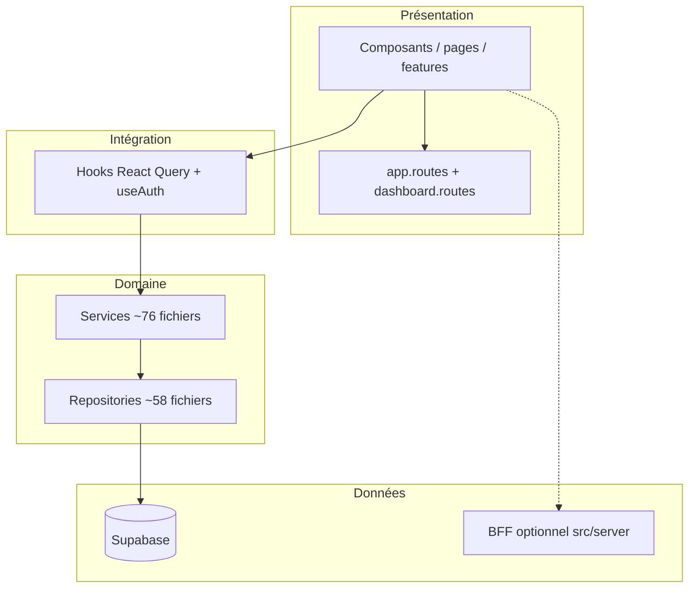

# Audit E-Samba — 12 juin 2026

> Bilan technique du dépôt **smart-fleet-africa** (produit **Flotte E-Samba**).  
> Référence canonique : [docs/architecture/CURRENT_ARCHITECTURE.md](../architecture/CURRENT_ARCHITECTURE.md).

## Synthèse exécutive

| Domaine | État | Note |
|---------|------|------|
| Stack web | Vite 7 + React 18 + React Router 6 | Production-ready |
| Données | Supabase (PostgreSQL + Auth + RLS) | Source de vérité : `supabase/migrations/` |
| Architecture client | Composants → Hooks → Services → Repositories | Respectée sur les entités principales |
| Mobile | Capacitor 8 (`com.esamba.flotte`) | Build `capacitor`, sync Android/iOS OK |
| Auth | React Context + Supabase PKCE | Pas de `authStore` Zustand |
| Multi-tenant | `useAuth` (`orgId`, `userFleetId`, `activeTenantContext`) | Pas de hook `useOrg` dédié |
| Dashboard | Routes unifiées sous `dashboard.routes.tsx` | Web + natif via `DashboardLayout` |

## Architecture



### Points d'entrée

| Fichier | Rôle |
|---------|------|
| `src/main.tsx` | Bootstrap (i18n, Sentry, PWA) |
| `src/App.tsx` | `BrowserRouter`, `Providers`, routes |
| `src/app/routes/app.routes.tsx` | Arborescence racine |
| `src/app/routes/dashboard.routes.tsx` | Routes protégées dashboard |
| `src/integrations/supabase/client.ts` | Client Supabase runtime |

### Couches (exemple véhicules)

```
useVehicles → VehicleService → VehicleRepository → supabase.from('vehicules')
```

## Authentification

- **Hook public** : `src/hooks/useAuth.ts` → `useAuthContext()`
- **Provider** : `src/contexts/AuthProvider.tsx` (Supabase ou mock `VITE_USE_MOCK_AUTH`)
- **Session** : `localStorage` clé `sfa_auth_token`, PKCE, refresh auto
- **Capacitor** : `detectSessionInUrl: false` ; session via deep link `esamba://auth/callback`
- **Post-login** : `src/hooks/useAuthFlow.ts` (onboarding, billing)

**Équivalent `useOrg`** : `useAuth().orgId`, `activeTenantContext`, `tenantOptions`.

## Pages dashboard ciblées

| Écran | Route | Fichier actif |
|-------|-------|---------------|
| Dashboard | `/dashboard` | `src/features/home/screens/MobileHomePage.tsx` |
| Véhicules | `/dashboard/vehicles` | `src/features/fleet/screens/MobileFleetPage.tsx` |
| Détail véhicule | `/dashboard/vehicles/:vehicleId` | `src/features/fleet/screens/FleetVehicleDetailPage.tsx` |
| Alertes | `/dashboard/alerts` | `src/features/alerts/screens/MobileAlertsPage.tsx` |

**Legacy non routé** : `src/pages/Vehicles.tsx`, `src/pages/VehicleDetail.tsx` (à ne pas confondre avec les routes actives).

## Configuration build

| Outil | Fichier | Particularité |
|-------|---------|---------------|
| Vite | `vite.config.ts` | Port **8080**, `base: './'` en mode `capacitor` |
| Capacitor | `capacitor.config.ts` | `webDir: dist`, `appId: com.esamba.flotte` |
| Tailwind | `tailwind.config.ts` | Tokens HSL, `darkMode: class` |
| Styles | `src/index.css` | Variables design system |
| Env | `.env.local` (depuis `.env.example`) | `VITE_SUPABASE_*` obligatoires |

## Mobile (Capacitor)

- **Préparation** : `npm run mobile:prepare` (`build:capacitor` + `cap:sync`)
- **Push** : `@capacitor/push-notifications` + `PushNotificationBridge.tsx`
- **Deep links** : `esamba://` + App Links HTTPS — voir `docs/deep-links-esamba.md`
- **Release** : `npm run android:assemble-release` (APK), `npm run android:bundle` (AAB)

## Écarts vs guide bootstrap minimal

| Guide générique | Réalité dépôt |
|-----------------|---------------|
| `vite-setup.sh` à la racine | Script fourni : `scripts/vite-setup.sh` |
| `localhost:3000` | `http://localhost:8080` |
| `src/store/authStore.ts` | **Absent** — Context + `useAuth` |
| `src/lib/supabase.ts` seul | Barrel → `integrations/supabase/client.ts` |
| `npm run build` pour Capacitor | **`npm run build:capacitor`** obligatoire |

## Risques / dette identifiés

1. **Pages legacy véhicules** orphelines (`src/pages/Vehicles.tsx`) — risque de confusion dev.
2. **Double app web** : Vite SPA (ce dépôt) + `apps/esamba-web` (Next.js) — bien séparer les contextes.
3. **Secrets** : ne jamais committer `.env.local`, `google-services.json` avec clés prod sans revue.
4. **SDK Android** : `ANDROID_HOME` optionnel si `android/local.properties` présent.

## Commandes de vérification

```powershell
npm run check:supabase
npm run dev                    # http://localhost:8080
npm run quality              # lint + typecheck + test
npm run mobile:prepare
npm run cap:doctor
```

## Livrables associés (bootstrap)

| Fichier | Contenu |
|---------|---------|
| `scripts/vite-setup.sh` | Setup dépôt existant (`npm run setup:vite` sous Windows) |
| `scripts/vite-greenfield-setup.sh` | Scaffolding nouveau projet `esamba-app/` (Vite + Capacitor from scratch) |
| `docs/bootstrap/vite-config-files.ts` | Référence 6 configs |
| `docs/bootstrap/vite-app-core.tsx` | Auth + App + Layout |
| `docs/bootstrap/vite-pages-dashboard.tsx` | 4 pages dashboard |
| `docs/bootstrap/capacitor-mobile-setup.md` | Android, push, deep links, APK |

---

*Audit généré le 12 juin 2026 — aligné sur l'état du dépôt smart-fleet-africa.*
