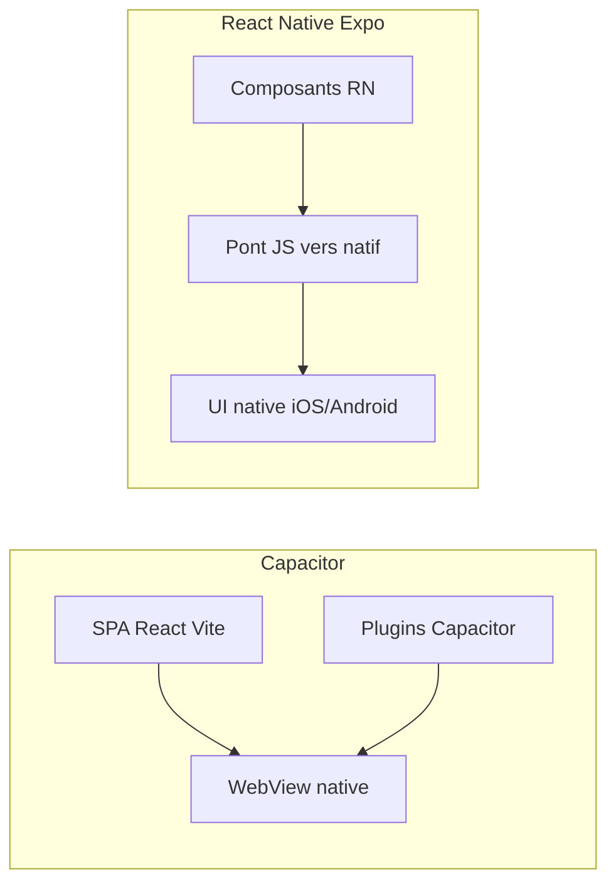

# Capacitor vs React Native : quoi choisir ?

Guide de décision pour la stratégie mobile **E-Samba / Flotte**. Complète les guides opérationnels Capacitor ([`capacitor-mobile-setup.md`](bootstrap/capacitor-mobile-setup.md)) et la roadmap post-MVP ([`mobile-scalable-roadmap.md`](mobile-scalable-roadmap.md)).

## En une phrase

**Il n’y a pas de « meilleur » universel** : Capacitor et React Native répondent à des problèmes différents. Capacitor = réutiliser une app web dans une coque native ; React Native = construire une app mobile native avec JavaScript.

---

## Comment ça marche (modèle mental)

| | **Capacitor** | **React Native (Expo)** |
|---|---|---|
| **UI** | HTML/CSS (Tailwind, shadcn) dans une WebView | Composants natifs (`View`, `Text`, etc.) |
| **Code partagé avec le web** | Très élevé (même codebase) | Faible à moyen (logique partageable, UI à refaire) |
| **Look & feel** | « App web bien faite » | Plus proche d’une app native |
| **Performance** | Suffisante pour dashboards, formulaires, listes | Meilleure pour listes longues, animations, offline lourd |
| **Accès natif** | Via plugins Capacitor | Via modules Expo / natifs |
| **Time-to-market** | Rapide si le web existe déjà | Plus lent (écrans à réécrire) |
| **Maintenance** | 1 codebase web + sync natif | 2 codebases (web + mobile) ou monorepo complexe |
| **Mises à jour UI** | OTA possible (contenu web) ; binaire store pour plugins natifs | EAS Update pour le JS ; binaire store pour changements natifs |

---

## Quand Capacitor est le meilleur choix

- Vous avez **déjà une SPA React** mature (Vite, React Router, shadcn).
- Priorité : **livrer vite** sur Play Store / App Store avec **toutes les fonctionnalités web**.
- L’équipe est surtout **web** (React/TypeScript), peu mobile natif.
- Les besoins natifs sont **modérés** : push, caméra, géoloc, biométrie, deep links, stockage local.
- Vous acceptez un rendu « web mobile optimisé » plutôt qu’une UI 100 % native.

**Forces** : un seul produit à maintenir, corrections web = corrections mobile, coût initial faible.

**Limites** : perf WebView sur listes très longues ou animations complexes ; widgets écran d’accueil limités ; offline avancé plus difficile qu’avec MMKV/SQLite natif.

---

## Quand React Native (Expo) est le meilleur choix

- L’expérience **terrain** est critique : conducteurs, faible réseau, usage intensif offline.
- Besoin de **widgets**, **animations fluides**, **scan QR** très réactif, **listes massives** (FlashList).
- Vous visez une **app mobile autonome**, pas un « dashboard web embarqué ».
- Vous acceptez **investir** dans une 2e codebase (ou une refonte progressive écran par écran).
- L’équipe peut porter **Expo, EAS Build, stores natifs**.

**Forces** : perf et UX natives, offline robuste (MMKV, SQLite), écosystème mobile riche.

**Limites** : duplication UI, synchronisation des features web/mobile, pipeline build séparé (EAS), courbe d’apprentissage RN.

---

## Contexte E-Samba (état du dépôt)

Dans ce dépôt, **les deux pistes existent déjà** :

| Piste | État | Rôle documenté |
|---|---|---|
| **Capacitor** | Mature — push, biométrie, deep links, CI release Android/iOS, dashboard complet | Mobile embarqué officiel dans [`CURRENT_ARCHITECTURE.md`](architecture/CURRENT_ARCHITECTURE.md) |
| **Expo** (`apps/mobile`) | Prototype — tutoriels vidéo seulement, pas d’auth ni métier | Vision [`ROADMAP.md`](../ROADMAP.md) §2.7 ; option future dans [`week-0-contracts.md`](migration-option-c/week-0-contracts.md) |

**Synthèse** : Capacitor = prod aujourd’hui ; Expo = socle technique pour une app native future, pas encore l’app terrain principale.

Guides associés :

- Capacitor (opérationnel) : [`bootstrap/capacitor-mobile-setup.md`](bootstrap/capacitor-mobile-setup.md)
- Expo (tutoriels) : [`apps/mobile/README.md`](../apps/mobile/README.md)
- Roadmap post-MVP Capacitor : [`mobile-scalable-roadmap.md`](mobile-scalable-roadmap.md)
- Offline web + mobile : [`offline-rollout-incremental-web-mobile.md`](offline-rollout-incremental-web-mobile.md)

---

## Grille de décision rapide

Répondez à ces questions :

1. **Le web couvre-t-il déjà 80 %+ des besoins mobile ?** → Oui = Capacitor ; Non = RN.
2. **L’offline est-il critique (sync différée, queue métier, jours sans réseau) ?** → Oui = RN favorisé.
3. **Budget équipe : une seule codebase ou deux ?** → Une = Capacitor ; Deux acceptables = RN possible.
4. **Délai store (< 3 mois vs > 6 mois) ?** → Court = Capacitor ; Long = RN envisageable.
5. **Perf / widgets / biométrie avancée ?** → Modérés = Capacitor suffit ; Exigeants = RN.

---

## Option hybride (scalable)

Si vous hésitez à long terme :

- **Court terme** : Capacitor pour le dashboard complet (déjà en place).
- **Ciblé RN** : écrans à forte contrainte native (scan QR terrain, offline lourd, tutoriels) dans `apps/mobile` ou modules natifs.
- **Partage logique** : extraire services, types, validation Zod, `packages/offline-core` — **pas** la couche UI.

Évite de tout réécrire d’un coup tout en préparant une migration progressive si le produit le justifie.

---

## Recommandation générale

| Priorité | Choix recommandé |
|---|---|
| SaaS B2B, dashboard, time-to-market, équipe web | **Capacitor** |
| App terrain offline-first, UX native, widgets | **React Native (Expo)** |
| Incertain | **Capacitor d’abord**, mesurer (perf, rétention, feedback terrain), migrer les écrans critiques vers RN si besoin |

**Capacitor n’est pas « moins bien »** — c’est le bon outil quand le web est le produit principal. **React Native n’est pas « toujours mieux »** — c’est le bon outil quand le mobile est le produit principal avec exigences natives fortes.

---

## Pour trancher sur E-Samba

Quand vous voudrez une recommandation **projet** (pas seulement générale), précisez :

- Part des utilisateurs **mobile-only** vs desktop
- Exigences **offline** (DVIR, incidents sans réseau)
- Roadmap **widgets / scan / push** avancés
- Capacité à maintenir **2 apps** (web+Capacitor vs web+Expo)

Voir aussi la checklist mobile terrain : [`migration-option-c/week-5-mobile-readiness.md`](migration-option-c/week-5-mobile-readiness.md).
