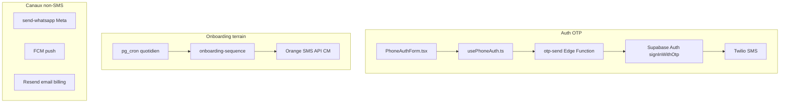

# Audit coût / délivrabilité SMS CEMAC — E-Samba

**Date** : juin 2026  
**Périmètre** : Twilio vs Orange SMS API vs Brevo SMS  
**Scénario prioritaire** : S0 (50 conducteurs, 5 flottes, 80 % Cameroun)  
**Taux de change retenu** : 1 USD = 600 FCFA (indicatif)

Document complémentaire : [`docs/supabase-pro-validation.md`](supabase-pro-validation.md) (état prod OTP).

---

## 1. Résumé exécutif

E-Samba ne doit **pas** choisir un fournisseur unique pour tous les SMS. L’architecture actuelle du dépôt est cohérente avec une stratégie **multi-canal** :

| Cas d’usage | Provider recommandé | Coût S0 estimé |
|-------------|---------------------|----------------|
| OTP auth mobile (7 pays CEMAC) | **Twilio** (via Supabase Auth) | ~28,76 USD / mois (~17 256 FCFA) |
| Relances onboarding chauffeurs CM | **Orange SMS API** | ~176 FCFA / mois |
| Campagnes marketing B2B (futur) | **Brevo** (optionnel) | Hors scope S0 |
| Alertes terrain temps réel | **WhatsApp Meta** (déjà en place) | Hors audit SMS |

**Coût hybride recommandé (S0)** : **~17 432 FCFA / mois** (Twilio OTP + Orange onboarding CM).

**Écarts clés** :

- Orange CM : **~8 à 12× moins cher** que Twilio pour les SMS longs d’onboarding.
- Brevo (hypothèse 80 FCFA/segment CM) : **~2,3× moins cher** que Twilio pour l’OTP, mais **non intégré** à Supabase Auth Phone.
- Twilio reste **indispensable** pour activer l’auth téléphone sans refonte (`provider_error` en prod aujourd’hui).

Recalcul paramétrique :

```bash
node scripts/estimate-sms-cemac-cost.mjs --scenario all
node scripts/estimate-sms-cemac-cost.mjs --scenario s0 --json
```

---

## 2. Inventaire des flux SMS (code → provider)



### 2.1 Flux actifs

| ID | Cas d’usage | Déclencheur | Fichiers | Provider | Pays |
|----|-------------|-------------|----------|----------|------|
| F1 | OTP login / resend | Action utilisateur | [`src/hooks/usePhoneAuth.ts`](../src/hooks/usePhoneAuth.ts), [`supabase/functions/otp-send/index.ts`](../supabase/functions/otp-send/index.ts), [`supabase/config.toml`](../supabase/config.toml) | Twilio (Supabase Auth) | CM, CD, GA, CG, CF, TD, GQ |
| F2 | Relance chauffeur inactif J+3 | Cron 07:00 | [`supabase/functions/onboarding-sequence/index.ts`](../supabase/functions/onboarding-sequence/index.ts) | Orange `ORANGE_SMS_TOKEN` | **CM uniquement** (+237 hardcodé) |
| F3 | Relance chauffeur inactif J+14 | Cron 07:00 | Idem F2 | Orange | CM uniquement |
| F4 | Validation / anti-spam OTP | Avant envoi F1 | [`supabase/migrations/20260518000003_phone_auth.sql`](../supabase/migrations/20260518000003_phone_auth.sql) | — | Tous |

### 2.2 Flux non-SMS (contexte)

| ID | Canal | Fichiers | Rôle |
|----|-------|----------|------|
| F5 | WhatsApp | [`supabase/functions/send-whatsapp/`](../supabase/functions/send-whatsapp/), [`src/services/alert.service.ts`](../src/services/alert.service.ts) | Alertes métier conducteurs |
| F6 | FCM push | [`supabase/functions/onboarding-sequence/`](../supabase/functions/onboarding-sequence/index.ts) J+1, [`send-notification`](../supabase/functions/send-notification/index.ts) | Notifications app |
| F7 | Email | [`process-notification-queue`](../supabase/functions/process-notification-queue/index.ts) | Billing (Resend) |

### 2.3 Flux futurs (plan Pro)

Le plan **Pro** annonce « Alertes intelligentes (push, e-mail, **SMS**) » dans [`src/components/landing/PricingSection.tsx`](../src/components/landing/PricingSection.tsx). **Aucun envoi SMS d’alerte métier n’est implémenté** aujourd’hui (WhatsApp utilisé à la place).

Hypothèse de modélisation (script) : `proAlertSmsPerDriver = 0` par défaut. À recalculer si une alerte SMS/mois/conducteur est ciblée.

### 2.4 Risques code identifiés

1. **Orange CM-only** : `sendOrangeSMS` force `tel:+237` et normalise en +237 — pas de SMS onboarding hors Cameroun.
2. **OTP prod inactif** : sonde `otp-send` → `502 provider_error` ([`docs/supabase-pro-validation.md`](supabase-pro-validation.md)).
3. **Messages onboarding longs** (~250–400 car.) → **2 segments** facturés (GSM-7, limite 160 car./segment).
4. **Rate limit OTP** : max 3 envois / 10 min, max 10 / h par numéro — plafonne les abus mais peut augmenter les resends légitimes.

---

## 3. Hypothèses de volume et formules

### 3.1 Paramètres communs

| Paramètre | Symbole | Défaut | Source / justification |
|-----------|---------|--------|------------------------|
| Part auth téléphone | `phoneAuthShare` | 60 % | Mix email + téléphone terrain |
| OTP / user / mois | `otpPerUser` | 3 | Connexion + 1 resend moyen |
| Segments / OTP | `segmentsPerOtp` | 1 | Template court Supabase |
| Nouveaux chauffeurs / mois | `newDrivers` | variable | Croissance par scénario |
| Taux inactivité onboarding | `inactivityRate` | 30 % | Chauffeurs sans créneau J+3/J+14 |
| SMS onboarding / chauffeur | `onboardingSms` | 2 | J+3 et J+14 |
| Segments / SMS onboarding | `segmentsOnboarding` | 2 | Messages longs dans `SEQUENCE` |

### 3.2 Formules

```
phoneAuthUsers     = drivers × phoneAuthShare
otpSegments        = phoneAuthUsers × otpPerUser × segmentsPerOtp
onboardingMessages = round(newDrivers × inactivityRate × onboardingSms)
onboardingSegments = onboardingMessages × segmentsOnboarding
onboardingSegCM    = round(onboardingSegments × cmShare)
```

Répartition OTP hors CM : segments restants répartis équitablement sur GA, CG, CF, TD, GQ, CD.

### 3.3 Scénarios calculés

| Scénario | Conducteurs | Flottes | Part CM | Nouveaux/mois | OTP seg. | Onboard. seg. | Total seg. |
|----------|-------------|---------|---------|---------------|----------|---------------|------------|
| **S0** (prioritaire) | 50 | 5 | 80 % | 8 | 90 | 10 (8 CM) | **100** |
| S1 (6 mois) | 400 | 30 | 60 % | 40 | 720 | 48 (29 CM) | 768 |
| S2 (12 mois) | 2 000 | 100 | 50 % | 120 | 3 600 | 144 (72 CM) | 3 744 |

Détail OTP S0 par pays :

| Pays | Indicatif | Segments |
|------|-----------|----------|
| Cameroun | +237 | 72 |
| Gabon | +241 | 3 |
| Congo | +242 | 3 |
| Centrafrique | +236 | 3 |
| Tchad | +235 | 3 |
| Guinée équ. | +240 | 3 |
| RD Congo | +243 | 3 |

---

## 4. Grille tarifaire (juin 2026)

### 4.1 Twilio — outbound SMS / segment (USD)

Sources : [twilio.com/sms/pricing](https://www.twilio.com/en-us/sms/pricing) par code ISO.

| Pays | ISO | USD/segment | ≈ FCFA/segment |
|------|-----|-------------|----------------|
| Cameroun | CM | 0,3170 | 190 |
| Gabon | GA | 0,3146 | 189 |
| Congo | CG | 0,3371 | 202 |
| Centrafrique | CF | 0,4518 | 271 |
| Tchad | TD | 0,3458 | 207 |
| Guinée équatoriale | GQ | 0,2705 | 162 |
| RD Congo | CD | 0,2584 | 155 |

**Coûts fixes** : Messaging Service ~0 USD ; numéro international optionnel ~1,15 USD/mois.  
**Surcoûts possibles** : carrier fees, messages multi-segments, échec ($0,001/msg).

**Intégration** : native Supabase Auth (`sms_provider: twilio`) — [`scripts/apply-supabase-pro-dashboard-steps.mjs`](../scripts/apply-supabase-pro-dashboard-steps.mjs).

### 4.2 Orange SMS API — Cameroun (FCFA)

Source : [Orange Developer SMS CM — Pricing](https://developer.orange.com/apis/sms-cm/pricing)

| Bundle | SMS | FCFA total | FCFA/SMS |
|--------|-----|------------|----------|
| Bundle 1 | 100 | 2 200 | 22 |
| Bundle 3 | 1 000 | 22 000 | 22 |
| Bundle 5 | 10 000 | 170 000 | 17 |
| Bundle 6 | 50 000 | 800 000 | 16 |

- **Couverture** : Cameroun, tous opérateurs (Orange, MTN, Camtel).
- **Paiement** : Orange Money / airtime.
- **Limite** : 100 000 FCFA / jour / SIM (largement au-dessus de S0–S1).
- **Sender ID** « E-Samba » : gratuit (formulaire commercial Orange).
- **Non compatible** Supabase Auth Phone.

### 4.3 Brevo SMS — crédits prépayés

Source : [Tarification SMS Brevo](https://help.brevo.com/hc/fr/articles/208717449)

- Pays CEMAC listés : CM (237), TD (235), CD (243), etc.
- **Pas de grille publique par pays** : tarif via calculateur compte (Mon offre → SMS).
- Crédits en packs de 100, sans expiration.

**Hypothèses audit** (à remplacer après calculateur / envoi test) :

| Destination | FCFA/segment (hyp.) | Variable script |
|-------------|---------------------|-----------------|
| Cameroun | 80 | `BREVO_FCFA_PER_SEGMENT_CM` |
| Autres CEMAC | 90 | `BREVO_FCFA_PER_SEGMENT_OTHER` |

Commande pour ajuster :

```bash
BREVO_FCFA_PER_SEGMENT_CM=75 node scripts/estimate-sms-cemac-cost.mjs --scenario s0
```

---

## 5. Comparatif coût mensuel

### 5.1 Scénario S0 (prioritaire)

| Provider | Périmètre | USD | FCFA |
|----------|-----------|-----|------|
| **Twilio** | OTP seul (90 seg.) | 28,76 | 17 256 |
| Twilio | Onboarding si tout Twilio (10 seg. @ CM) | 3,17 | 1 902 |
| Twilio | **Total si mono-provider** | 31,93 | 19 158 |
| **Orange** | Onboarding CM (8 seg.) | — | **176** |
| Brevo (hyp.) | OTP seul | — | 7 380 |
| Brevo (hyp.) | Tout SMS (100 seg.) | — | 8 180 |
| **Hybride recommandé** | Twilio OTP + Orange CM | 28,76 | **17 432** |

**Ratios S0** :

- Onboarding 10 seg. : Orange 176 FCFA vs Twilio ~1 902 FCFA → **~11× moins cher** en local.
- OTP 72 seg. CM : Twilio ~13 694 FCFA vs Brevo hyp. ~5 760 FCFA → Brevo moins cher mais **sans intégration Auth**.

### 5.2 Projection S1 et S2

| Scénario | Segments/mois | Twilio OTP | Orange onboard. | Hybride | Brevo tout (hyp.) |
|----------|---------------|------------|-----------------|---------|-------------------|
| S0 | 100 | 17 256 FCFA | 176 FCFA | **17 432 FCFA** | 8 180 FCFA |
| S1 | 768 | 139 140 FCFA | 638 FCFA | **139 778 FCFA** | 64 320 FCFA |
| S2 | 3 744 | 698 436 FCFA | 1 584 FCFA | **700 020 FCFA** | 317 520 FCFA |

À l’échelle S2, négocier **Twilio Committed-Use** ou revoir le mix WhatsApp/push pour les relances non critiques.

### 5.3 Coût par conducteur actif (hybride)

| Scénario | FCFA / conducteur / mois |
|----------|--------------------------|
| S0 | ~349 |
| S1 | ~349 |
| S2 | ~350 |

Le coût SMS reste **dominé par l’OTP Twilio**, pas par l’onboarding Orange.

---

## 6. Matrice délivrabilité

| Critère | Twilio | Orange CM | Brevo SMS |
|---------|--------|-----------|-----------|
| Intégration Supabase Auth Phone | **Native** | Non | Non |
| Couverture 7 pays CEMAC | **Oui** | CM seul | Oui (liste Brevo) |
| Route locale CM | Moyenne (international) | **Élevée** | Variable (agrégateur) |
| Délai OTP typique | 5–30 s | 5–60 s (CM) | 10–60 s |
| Sender ID « E-Samba » | Alphanumeric (selon pays) | **Gratuit** (formulaire) | Par pays, enregistrement 2026+ |
| SMS longs multi-segments | Coût × segments | **Économique** | Coût × segments |
| Paiement FCFA / Orange Money | Non (USD) | **Oui** | EUR/USD |
| DR / statistiques | Dashboard + webhooks | API `/sms/admin/v1/statistics` | Dashboard Brevo |
| Anti-fraude OTP | Twilio Verify (option) | N/A | Limité |
| Conformité marketing | N/A (transactionnel) | Horaires / consentement | Opt-in, quiet hours |

### Recommandation par cas d’usage

| Cas d’usage | Choix | Ne pas utiliser |
|-------------|-------|-----------------|
| OTP auth tous pays CEMAC | **Twilio** | Brevo, Orange (pas d’intégration Auth) |
| Onboarding / relance CM | **Orange** | Twilio (coût ×10) |
| Campagnes email + SMS B2B | **Brevo** (si besoin marketing) | Twilio pour bulk |
| Alertes conducteurs | **WhatsApp Meta** (existant) | SMS sauf OTP |

---

## 7. Plan de validation terrain

Exécuter après configuration des secrets (sans envoi massif).

### 7.1 Twilio + Supabase Auth

1. Renseigner `TWILIO_ACCOUNT_SID`, `TWILIO_MESSAGE_SERVICE_SID`, `TWILIO_AUTH_TOKEN` dans `.env.local`.
2. Lancer `npm run apply:supabase-pro` ou [`scripts/apply-supabase-pro-dashboard-steps.mjs`](../scripts/apply-supabase-pro-dashboard-steps.mjs).
3. Tester : `npm run verify:supabase-pro -- --otp-only` sur +237, +241, +235.
4. Succès attendu : `200 ok: true` (plus de `502 provider_error`).

### 7.2 Orange SMS CM

1. Configurer `ORANGE_SMS_TOKEN` et déployer `onboarding-sequence`.
2. Envoyer 1 SMS test vers Orange, MTN et Camtel.
3. Vérifier DR via `GET /sms/admin/v1/statistics`.
4. Mesurer segments facturés sur le template J+3 réel (attendu : 2 segments).

### 7.3 Brevo SMS

1. Compte trial → calculateur (CM, TD, GA) → mettre à jour `BREVO_FCFA_PER_SEGMENT_*`.
2. 3 envois test transactionnels → noter délai et taux de livraison.
3. Comparer au coût Twilio sur les mêmes numéros.

### 7.4 Affinage post-prod (30 jours)

```sql
-- Volume OTP réel
SELECT date_trunc('day', created_at) AS jour, COUNT(*) AS envois
FROM public.otp_rate_limits
WHERE action = 'send'
GROUP BY 1 ORDER BY 1 DESC LIMIT 30;

-- SMS onboarding envoyés
SELECT step_day, channel, COUNT(*) AS n
FROM public.onboarding_sequence_log
WHERE channel = 'sms'
GROUP BY 1, 2;
```

Recalculer : `node scripts/estimate-sms-cemac-cost.mjs --drivers <N> --cm-share <0.x>`.

---

## 8. Annexe — extension hors CM (onboarding)

Pour couvrir GA/TD/CF/etc. en SMS onboarding, options :

| Option | Coût | Effort |
|--------|------|--------|
| A. WhatsApp (déjà implémenté) | Meta utility ~gratuit–faible | Faible — privilégier |
| B. Twilio par pays | Élevé | Moyen — router par indicatif |
| C. Opérateurs locaux (Orange AMEA, etc.) | Variable | Élevé — contrat par pays |
| D. Brevo campagnes | Moyen | Moyen — hors Auth |

**Recommandation** : option A pour hors CM ; garder Orange pour CM uniquement.

---

## 9. Références

- [Twilio SMS pricing CM](https://www.twilio.com/en-us/sms/pricing/cm)
- [Orange SMS Cameroon API](https://developer.orange.com/apis/sms-cm)
- [Brevo — pays et tarifs SMS](https://help.brevo.com/hc/fr/articles/208717449)
- Script : [`scripts/estimate-sms-cemac-cost.mjs`](../scripts/estimate-sms-cemac-cost.mjs)
